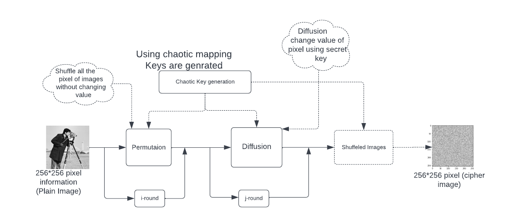

# Cryptographic-Key-Generation
This  Research provide the optimal way to  generate cryptographic key for different Encryption Technnique.
<h1>Understanding basic of Cryptography</h1>
<ul>
 <a href="https://github.com/nishantkumar1308/Cryptographic-Key-Generation/blob/main/Cryptographic_key_generation.ipynb"><li> Chaotic Map</li></a>
  <a href="https://github.com/nishantkumar1308/Cryptographic-Key-Generation/blob/main/Lorenz_Attractor.ipynb"><li>Lorenz Map</li></a>
  <a href="https://github.com/nishantkumar1308/Cryptographic-Key-Generation/blob/main/henon_map.ipynb"> <li>Henon map </li></a>
  </ul>

<h3>Basic design of Key generation</h3>

